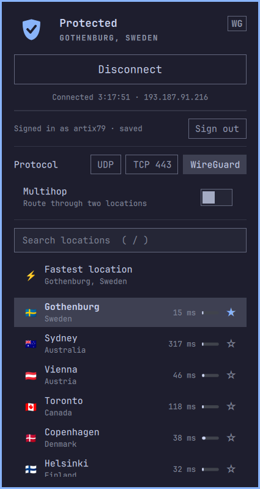

# OVPN Client for the Omarchy shell

A bar widget and panel for [OVPN](https://www.ovpn.com/) that works like the
official desktop client: one-click connect, a location list with ping, load
and favorites, WireGuard or OpenVPN, multihop, a drop notification and
auto-connect.



Plugin id: `pinta365.ovpn`.

NetworkManager does the tunnelling (`networkmanager-openvpn`), so there is no
daemon and nothing runs as root.

Not affiliated with, endorsed by, or supported by OVPN Integritet AB. It signs
in with your own OVPN account and talks to the same undocumented endpoints the
official client uses, which OVPN can change at any time. "OVPN" is their name,
used here only to say what this connects to.

`assets/ovpn-ca.pem` and `assets/ovpn-ta.key` are OVPN's own public files: the
certificate authority that proves a server is theirs, and the tls-auth key that
guards the handshake. They are byte-identical to the ones in OVPN's official
client and in every config they hand out, and are the same for all customers.
No private key is included.

## Install

```bash
omarchy plugin add https://github.com/Pinta365/omarchy-ovpn.git --enable
```

Requirements: `networkmanager-openvpn`, for the OpenVPN protocols, which a
stock Omarchy install does not include. WireGuard needs nothing extra — the
kernel and NetworkManager already handle it. Everything else it uses
(NetworkManager, `gnome-keyring`, `libsecret`, `python-gobject`, `iputils`,
`openssl`) ships with Omarchy.

## Remove

```bash
~/.config/omarchy/plugins/pinta365.ovpn/helper/ovpnctl.py uninstall
omarchy plugin remove pinta365.ovpn
```

The first command disconnects and deletes what the plugin created outside its
folder: both `OVPN (Omarchy)` NetworkManager profiles, the remembered password
in your keyring, and `~/.local/state/ovpn-omarchy` and `~/.cache/ovpn-omarchy`.
Your own NetworkManager connections are never touched.

It also removes the WireGuard key from your OVPN account, but only while it can
still authenticate — that needs the remembered password. Sign out first, or
delete the key yourself at
[ovpn.com/account/wireguard/keys](https://www.ovpn.com/account/wireguard/keys).

## Using it

- Click the shield to open the panel; middle-click connects to the last
  location or disconnects.
- Protocols: WireGuard, OpenVPN over UDP, or OpenVPN over TCP 443 for networks
  that block the rest.
- Multihop: switch it on, pick the entry location, then connect to the exit
  location as usual. Traffic enters OVPN at the entry and leaves from the exit.
  Works over WireGuard and UDP; OVPN has no TCP multihop ports.
- Right-click a location or press `f` to star it. `/` searches, `t` flips the
  protocol, `c` connects, `d` disconnects, `r` refreshes.
- IPC: `qs ipc -p $OMARCHY_PATH/shell call ovpn <open|close|toggle|connect|connectTo <slug>|disconnect|quickToggle|multihop <entry|off>|status>`

## WireGuard

The plugin generates a WireGuard key with `openssl`, registers the public half
with your OVPN account and keeps the private half in your keyring. The same key
is reused for every connection, so it counts once against OVPN's per-account
key limit, and it is removed from the account when you sign out or uninstall.

OVPN's key API cannot name keys, so yours appears unnamed at
[ovpn.com/account/wireguard/keys](https://www.ovpn.com/account/wireguard/keys),
where you can label it yourself.

## Credentials

Your OVPN username is kept in `~/.local/state/ovpn-omarchy/state.json`. The
password is:

- held in memory for the session by default, or
- stored in the Secret Service keyring (gnome-keyring) when you tick
  *Remember password*.

It never appears on a command line, in the plugin directory, or in
`shell.json`. It reaches NetworkManager over a pipe at each connect, the
managed profile `OVPN (Omarchy)` is created with `password-flags=2` (never
saved), and the copy NetworkManager keeps in memory after activation is
cleared as soon as the tunnel is up.

## Helper

`helper/ovpnctl.py` is the whole backend and works on its own:

```bash
helper/ovpnctl.py servers            # locations (cached for an hour)
helper/ovpnctl.py ping               # latency per location
helper/ovpnctl.py status --ip        # state and public IP
echo '{"username":"me","password":"…","remember":true}' | helper/ovpnctl.py connect sthlm
echo '{"password":"…"}' | helper/ovpnctl.py connect sthlm --proto tcp
echo '{"password":"…"}' | helper/ovpnctl.py connect oslo --via sthlm   # multihop
helper/ovpnctl.py connect malmo --proto wg                            # WireGuard
helper/ovpnctl.py disconnect
helper/ovpnctl.py watch              # one JSON line per state change
```

## Development

Develop in a checkout, copy it into `~/.config/omarchy/plugins/pinta365.ovpn`
and run `omarchy restart shell`. The shell's in-place plugin reload does not
follow a symlinked plugin directory and keeps running the old compiled QML,
so a restart is the reliable way to see a change.

## Not yet

A kill switch is planned.
